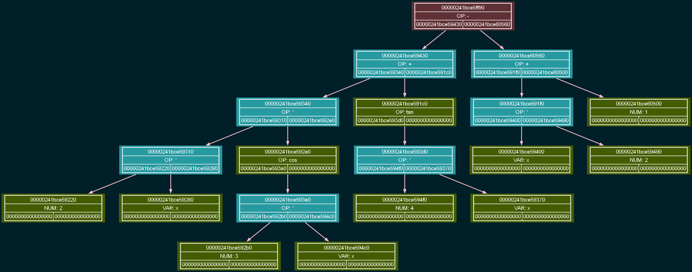
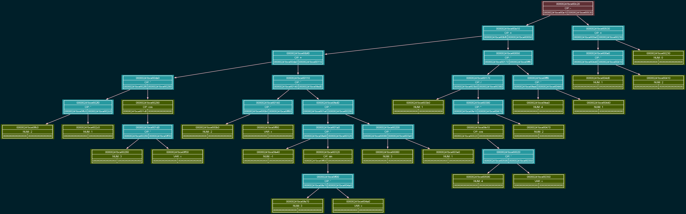

# Symbolic Math Differentiator

A system-level C application that parses mathematical expressions, builds a hierarchical syntax tree, calculates symbolic derivatives, and automatically generates formatted LaTeX reports. 

## Architecture & Pipeline

This project implements a complete processing pipeline for symbolic mathematics using custom data structures and algorithms:

1. **Recursive Descent Parser:** Reads a raw mathematical expression from a text file and constructs a syntax tree using the Recursive Descent algorithm. This top-down parsing technique elegantly handles mathematical operator precedence and parentheses by recursively breaking down the expression into hierarchical tree nodes (`RecursiveDescentReadTree.cpp`).
2. **Differentiation Engine:** Traverses the tree recursively, applying standard calculus rules (chain rule, basic derivatives) to compute the symbolic derivative (`differentiator.cpp`).
3. **Constant Convolution (Simplification):** A crucial optimization pass. It traverses the tree to fold constant expressions and eliminate mathematical redundancies (e.g., evaluating `2 + 3` to `5`, or simplifying `1 * x` to `x`). This prevents the output tree from growing exponentially (`ConfolutionOfConstants.cpp`).
4. **LaTeX Generation:** Translates the optimized tree into raw LaTeX code (`latexDump.cpp`), outputting a `latexDUMP.tex` file that can be compiled into a textbook-style PDF report.

## Visual Dumps & Debugging

Debugging complex tree structures in the console is inefficient. To solve this, the project features comprehensive visual dumping using **Graphviz** (`TreeGraphDump.cpp`). The internal state of the tree is serialized into `.dot` files and rendered as `.png` images.

### Original Expression Tree
*Generated from `original_tree.dot`*


### Derivative Tree (After Differentiation)
*Generated from `derivative_tree.dot`*


## Build and Run

The project uses `Make` for its build system.

### Prerequisites
* A C compiler (GCC/Clang)
* `Make`
* [Graphviz](https://graphviz.org/) (for rendering `.dot` files into images)
* A LaTeX distribution (optional, to compile the `.tex` report into a PDF)

### Compilation
Clone the repository and build the executable using the provided `makefile`:
```bash
git clone [https://github.com/your-username/Dirivator.git](https://github.com/your-username/Dirivator.git)
cd Dirivator
make